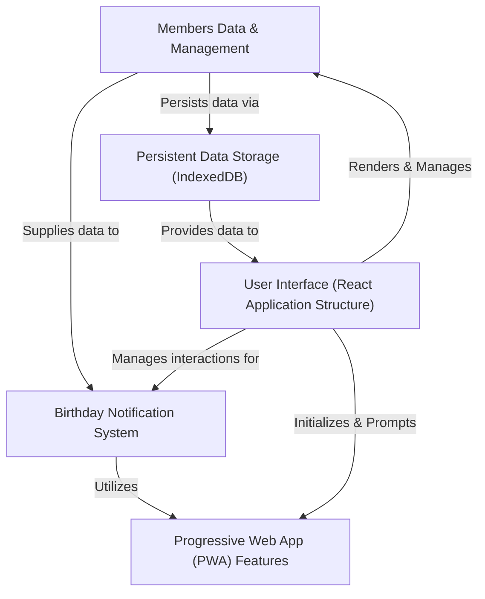
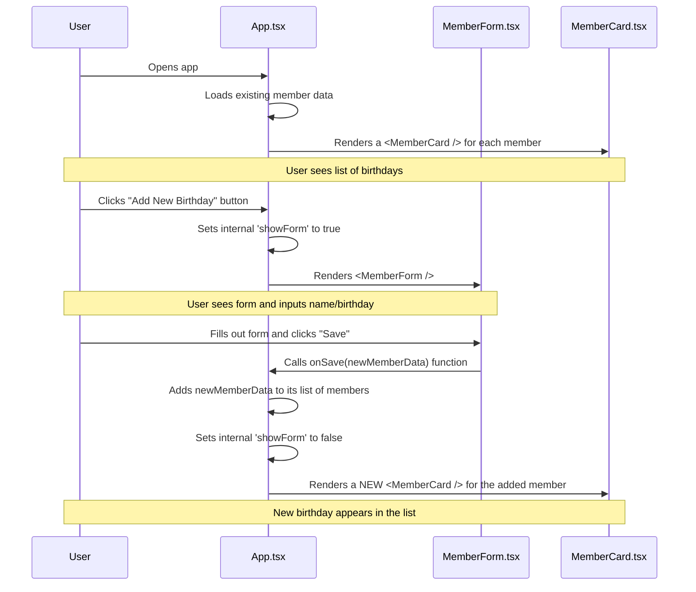
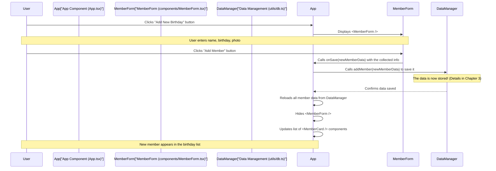
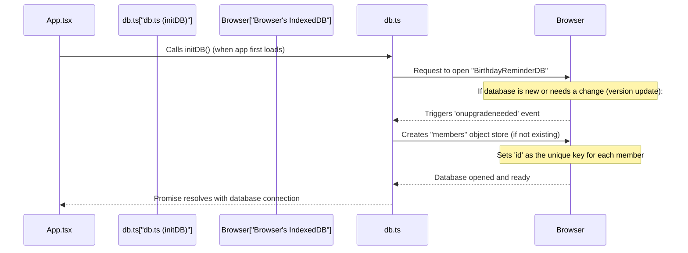
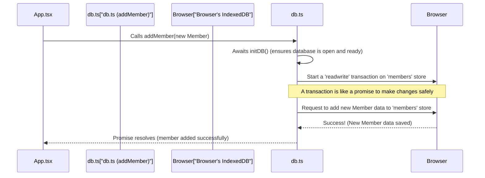
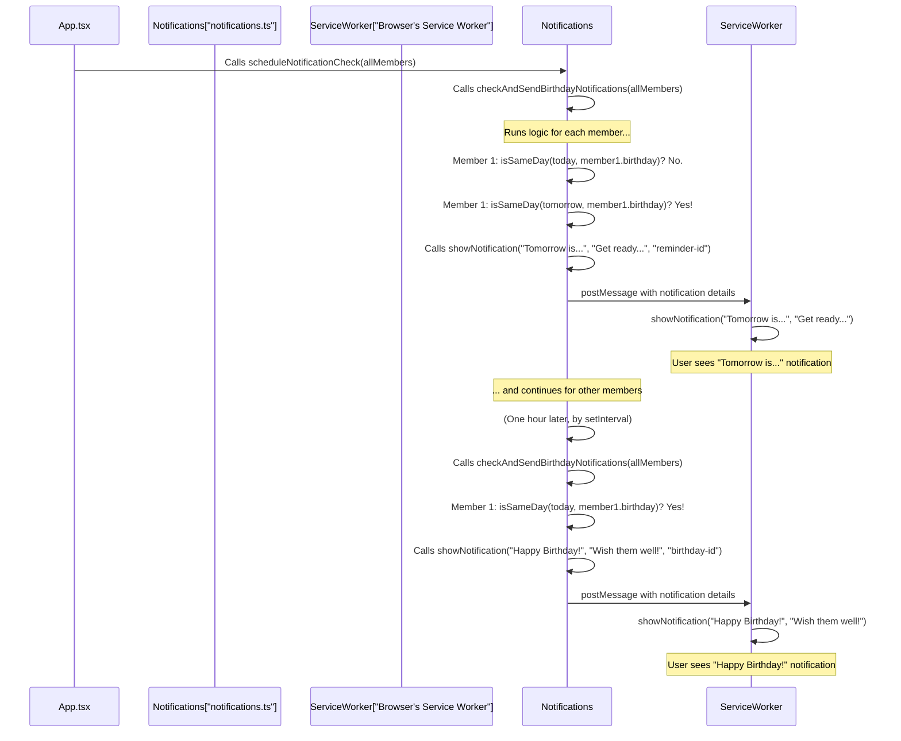
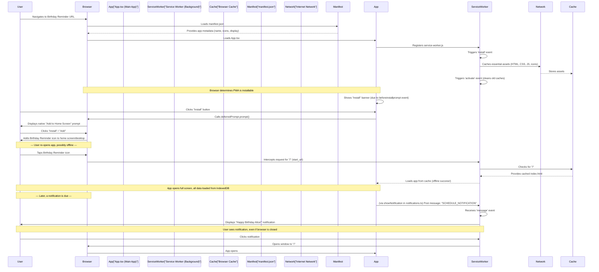

# Tutorial: Birthday_Remainder

This project is a *user-friendly* **Birthday Reminder** application designed to help you *never forget* someone's special day. It allows you to **add and manage** details for all your friends and family, stores their birthdays directly in your browser, and sends **timely notifications** to ensure you're always prepared to celebrate. You can even **install it like a native app** on your device!


## Visual Overview



## Chapters

1. [User Interface (React Application Structure)
](01_user_interface__react_application_structure__.md)
2. [Members Data & Management
](02_members_data___management_.md)
3. [Persistent Data Storage (IndexedDB)
](03_persistent_data_storage__indexeddb__.md)
4. [Birthday Notification System
](04_birthday_notification_system_.md)
5. [Progressive Web App (PWA) Features
](05_progressive_web_app__pwa__features_.md)

---

<sub><sup>Generated by [AI Codebase Knowledge Builder](https://github.com/The-Pocket/Tutorial-Codebase-Knowledge).</sup></sub>

# Chapter 1: User Interface (React Application Structure)

Welcome to the first chapter of our Birthday Reminder tutorial! We're going to start by looking at the "face" of our application – everything you see and interact with on the screen.

### What Problem Are We Solving?

Imagine you want to build a house. You wouldn't just throw all the materials together randomly, right? You'd plan for walls, windows, doors, and a roof, each built for a specific purpose. Building a software application's user interface (UI) is very similar! We need a structured way to create all the visual elements (like lists of birthdays, buttons to add new ones, and forms to type in details) and make them respond when you click or type.

Our **Birthday Reminder** app's main job is to show you upcoming birthdays and let you manage them easily. For example, when you open the app, you expect to **see a clear list of all your friends' birthdays**. If you want to **add a new friend**, you'll need a way to input their name and birthday. This chapter will explain how we use a tool called **React** to build these interactive parts of our app in an organized, easy-to-manage way.

### Building Blocks: React Components

Think of building a user interface with React like building with LEGO bricks. Each **LEGO brick is a "component"**.
*   A button is a component.
*   A text box is a component.
*   A whole card showing a friend's birthday is a component.

These components are reusable and self-contained. You can combine them to build more complex parts of your app, just like you combine LEGO bricks to build a bigger structure.

#### The Main Orchestrator: The `App` Component

Every React application needs a starting point, a "master builder" that brings all the smaller components together. In our Birthday Reminder app, this role is played by the `App` component (found in `src/App.tsx`).

The `App` component is like the main blueprint of our entire application's screen. It decides:
*   What main sections appear.
*   Which smaller components (like individual birthday cards or the "add new member" form) should be visible at any given time.
*   How different parts of the app communicate with each other.

Let's look at how our app first gets started.

**File: `src/main.tsx` (Simplified)**

```tsx
// src/main.tsx
// This file is the very first step when our app loads!
import { createRoot } from 'react-dom/client';
import App from './App.tsx'; // We import our main 'App' component here
import './index.css'; // This file adds global styles to our app

// We tell React to take control of the HTML element
// with the ID 'root' in our main index.html file.
const rootElement = document.getElementById('root')!;
const root = createRoot(rootElement);

// Then, we tell React to render (display) our 'App' component
// inside that 'root' element.
root.render(<App />);
```
**Explanation:** This is the absolute starting point of our React application. When you open the Birthday Reminder app in your browser, `main.tsx` is executed first. It tells React, "Hey, find a special spot on the webpage (an HTML element with the ID `root`) and draw everything from our `App` component there!"

#### Specialized Components: `MemberCard` and `MemberForm`

Just as a house has specialized rooms (a kitchen, a bedroom), our `App` component relies on smaller, specialized components:

*   **`MemberCard` (`src/components/MemberCard.tsx`):** This component's job is to beautifully display all the information for *one single person's birthday*. It shows their name, birthday date, photo, and how many days are left until their special day. It also has buttons to edit or delete that specific birthday.

*   **`MemberForm` (`src/components/MemberForm.tsx`):** This component is responsible for letting you *add a new birthday* or *edit an existing one*. It provides input fields for the name, birthday date, and photo.

This modular structure (using many small components) makes our app easier to understand, maintain, and build upon. Each component has a clear job, making development much smoother!

### How Components Work Together: A Use Case

Let's trace a simple user journey: You open the app, see your friends' birthdays, and decide to add a new one.

1.  **Showing the List:** The `App` component starts. It loads all the birthday information (we'll learn more about *where* this data comes from in [Members Data & Management](02_members_data___management_.md)). For each birthday it finds, `App` tells React to create a `MemberCard` component, passing all the specific birthday details to it.

2.  **Adding a New Birthday:** You click an "Add New Member" button. The `App` component notices this and updates an internal setting to "show the form." Because of this change, `App` now tells React to display the `MemberForm` component on the screen.

3.  **Filling the Form:** You type in the new friend's name and birthday into the `MemberForm`.

4.  **Saving the Data:** You click the "Add Member" button inside the `MemberForm`. The `MemberForm` then takes all the information you entered and "sends it back" to the `App` component. The `App` component then takes this new data, saves it (again, more on that in the next chapter!), and tells React to hide the `MemberForm` and update the list of `MemberCard`s to include the new friend.

This "parent-child" communication (where `App` is the parent and `MemberCard`/`MemberForm` are children) is a core concept in React.

#### The `App` Component in Action (Simplified)

Here's a simplified look at how `App.tsx` brings `MemberCard` and `MemberForm` together:

**File: `src/App.tsx` (Simplified)**

```tsx
// src/App.tsx
import { useState, useEffect } from 'react';
import MemberCard from './components/MemberCard';   // Import our MemberCard component
import MemberForm from './components/MemberForm';   // Import our MemberForm component
// ... other imports

function App() {
  // 'members' holds our list of all birthday friends.
  // 'showForm' is a switch to decide if the MemberForm should be visible.
  const [members, setMembers] = useState([]);
  const [showForm, setShowForm] = useState(false);

  // useEffect is used here to load birthdays when the app starts
  useEffect(() => {
    // ... logic to load members from storage
    // For now, imagine 'setMembers' gets a list of birthday friends
  }, []);

  // This function is called when MemberForm successfully saves data
  const handleSaveMember = (newMemberData) => {
    // ... logic to add/update member in our list and storage
    setShowForm(false); // Hide the form after saving!
  };

  return (
    <div className="main-app-container">
      <h1>Birthday Reminder</h1>

      {/* For EACH member in our 'members' list, we display a MemberCard */}
      <div className="birthday-cards-grid">
        {members.map(member => (
          <MemberCard
            key={member.id} // React needs a unique key for each item in a list
            member={member} // Pass the member's data to the MemberCard
            onEdit={() => {/* ... handle edit button click */}}
            onDelete={() => {/* ... handle delete button click */}}
          />
        ))}
      </div>

      {/* Button to open the Add/Edit form */}
      <button onClick={() => setShowForm(true)}>Add New Birthday</button>

      {/* The MemberForm is only shown IF 'showForm' is true */}
      {showForm && (
        <MemberForm
          onSave={handleSaveMember} // Pass our save function to the form
          onCancel={() => setShowForm(false)} // Pass a cancel function
        />
      )}
    </div>
  );
}

export default App;
```
**Explanation:** This simplified `App` component shows how it acts as the central hub.
*   It manages the main list of `members`.
*   It uses `members.map(...)` to create a `MemberCard` for every birthday friend. This is how React efficiently draws many similar items.
*   The `showForm` variable is like a toggle switch. When `showForm` is `true`, the `<MemberForm />` component appears on screen. When `false`, it disappears.
*   `onSave` and `onCancel` are examples of "props" (short for properties) that `App` passes to `MemberForm`. These props are actually functions! `App` gives `MemberForm` these functions so `MemberForm` can "call back" to `App` when the user saves or cancels. This is how data and actions flow between parent and child components.

### Behind the Scenes: A Simple User Flow

Let's visualize the "Add New Birthday" flow with a simple diagram.



### Deep Dive into Component Communication

React components communicate primarily through **props** (short for properties). Think of props like arguments you pass to a function, or settings you configure for a toy.

#### `MemberCard`: Receiving Data via Props

The `MemberCard` component needs to know *whose* birthday it's displaying. The `App` component gives it this information using a prop called `member`.

**File: `src/components/MemberCard.tsx` (Simplified)**

```tsx
// src/components/MemberCard.tsx
import { Cake, Edit, Trash2 } from 'lucide-react'; // Icons!

// This defines what kind of 'props' (inputs) our MemberCard expects
interface MemberCardProps {
  member: { id: string; name: string; birthday: string; photo?: string; }; // The actual birthday data
  onEdit: (member: any) => void;   // A function to call when 'Edit' is clicked
  onDelete: (id: string) => void;  // A function to call when 'Delete' is clicked
}

// Our MemberCard component receives its props in the parentheses
export default function MemberCard({ member, onEdit, onDelete }: MemberCardProps) {
  // We use the 'member' prop to display information
  const birthDate = new Date(member.birthday);
  const formattedDate = birthDate.toLocaleDateString('en-US');

  return (
    <div className="member-card-style">
      {member.photo && }
      <h3>{member.name}</h3>
      <p><Cake /> {formattedDate}</p>
      {/* When these buttons are clicked, they call the functions
          that were passed down as 'onEdit' and 'onDelete' props. */}
      <button onClick={() => onEdit(member)}> <Edit /> Edit </button>
      <button onClick={() => onDelete(member.id)}> <Trash2 /> Delete </button>
    </div>
  );
}
```
**Explanation:** `MemberCard` is a display component. It doesn't fetch data itself; it just *receives* the `member` object (which contains the name, birthday, etc.) as a prop from its parent (`App.tsx`). It also receives `onEdit` and `onDelete` as props. These are functions that `App.tsx` provided. When the user clicks "Edit" or "Delete," `MemberCard` simply calls these functions, passing the relevant `member` data or `id` back up. This is a common pattern for "child" components to "talk back" to their "parent" components.

#### `MemberForm`: Sending Data Back to the Parent

The `MemberForm` needs to collect user input (name, birthday, photo) and then send that information *up* to the `App` component when the user clicks "Save".

**File: `src/components/MemberForm.tsx` (Simplified)**

```tsx
// src/components/MemberForm.tsx
import { useState } from 'react';
import { X } from 'lucide-react'; // An icon for closing

// This defines the props MemberForm expects
interface MemberFormProps {
  member?: { name: string; birthday: string; photo?: string; }; // Optional: for editing existing members
  onSave: (member: any) => void; // Function to call when saving
  onCancel: () => void; // Function to call when cancelling
}

export default function MemberForm({ member, onSave, onCancel }: MemberFormProps) {
  // 'useState' helps us keep track of what the user types in the form inputs
  const [name, setName] = useState(member?.name || '');
  const [birthday, setBirthday] = useState(member?.birthday || '');
  // ... state for photo upload

  // This function runs when the user submits the form
  const handleSubmit = (e: React.FormEvent) => {
    e.preventDefault(); // Stop the browser from refreshing the page
    if (!name || !birthday) return; // Basic validation

    const newOrUpdatedMember = {
      id: member?.id || `member-${Date.now()}`, // Create an ID if new
      name,
      birthday,
      // ... photo
    };
    onSave(newOrUpdatedMember); // Call the 'onSave' function from props, passing the data
  };

  return (
    <div className="form-popup-overlay">
      <form onSubmit={handleSubmit} className="form-content">
        <h2>{member ? 'Edit Member' : 'Add New Member'}</h2>
        <button type="button" onClick={onCancel}> <X /> </button> {/* Call onCancel prop */}

        <label>Name *</label>
        <input type="text" value={name} onChange={(e) => setName(e.target.value)} required />

        <label>Birthday Date *</label>
        <input type="date" value={birthday} onChange={(e) => setBirthday(e.target.value)} required />

        <button type="submit"> {member ? 'Update' : 'Add Member'} </button>
        <button type="button" onClick={onCancel}>Cancel</button>
      </form>
    </div>
  );
}
```
**Explanation:** `MemberForm` uses `useState` to manage the temporary values typed into its input fields. When the "Add Member" or "Update" button is clicked (which triggers `handleSubmit`), it gathers all the input. Instead of saving the data itself, it calls the `onSave` function that was passed to it as a prop by its parent (`App.tsx`). It passes the collected birthday data back to the parent component. Similarly, clicking "Cancel" just calls the `onCancel` prop. This allows the `App` component to handle the actual saving and closing of the form.

### Conclusion

In this chapter, we've learned how our Birthday Reminder app uses React components to build its user interface. We saw that:
*   The `App` component acts as the main coordinator, deciding what to display.
*   Smaller components like `MemberCard` are used to show individual birthdays.
*   `MemberForm` allows users to add or edit birthday details.
*   Components communicate by passing `props` down (from parent to child) and by calling functions (also passed as `props`) back up (from child to parent).

This modular approach makes our app flexible and easy to manage, allowing us to build complex interfaces from simple, reusable pieces.

Now that we understand how the app's face is structured, the next crucial step is to understand *where* all this birthday data comes from and how it's managed behind the scenes.

[Next Chapter: Members Data & Management](02_members_data___management_.md)

---

<sub><sup>Generated by [AI Codebase Knowledge Builder](https://github.com/The-Pocket/Tutorial-Codebase-Knowledge).</sup></sub> <sub><sup>**References**: [[1]](https://github.com/RubanKumar13/Birthday_Remainder/blob/d6c314f0a63b6470c3d458cb519849753120b3f0/src/App.tsx), [[2]](https://github.com/RubanKumar13/Birthday_Remainder/blob/d6c314f0a63b6470c3d458cb519849753120b3f0/src/components/MemberCard.tsx), [[3]](https://github.com/RubanKumar13/Birthday_Remainder/blob/d6c314f0a63b6470c3d458cb519849753120b3f0/src/components/MemberForm.tsx), [[4]](https://github.com/RubanKumar13/Birthday_Remainder/blob/d6c314f0a63b6470c3d458cb519849753120b3f0/src/index.css), [[5]](https://github.com/RubanKumar13/Birthday_Remainder/blob/d6c314f0a63b6470c3d458cb519849753120b3f0/src/main.tsx), [[6]](https://github.com/RubanKumar13/Birthday_Remainder/blob/d6c314f0a63b6470c3d458cb519849753120b3f0/tailwind.config.js)</sup></sub>

# Chapter 2: Members Data & Management

Welcome back! In [Chapter 1: User Interface (React Application Structure)](01_user_interface__react_application_structure__.md), we explored the "face" of our Birthday Reminder app. We learned how `MemberCard` shows individual birthdays and `MemberForm` lets you type in details, all orchestrated by the main `App` component.

But here's a crucial question: where does all that birthday information actually *come from*? When you type a new name and date into the `MemberForm` and click "Save", where does it *go*? And how does `App` remember everyone's birthday even after you close and reopen the app?

This chapter will answer those questions! We'll dive into the "brain" and "memory" of our application: **Members Data & Management**. This is about defining what a "birthday friend" is, how their information is structured, and how we perform actions like adding, editing, or removing them.

### What Problem Are We Solving?

Imagine you have a big pile of sticky notes, each with a friend's name and birthday. It's hard to keep track, sort them, or quickly find whose birthday is next. Our app solves this by providing a structured way to store and manage this important information.

The central idea is to keep track of a specific type of information: a **Member**. Think of a "Member" as a single, organized record for one person whose birthday we want to remember.

**Use Case: Adding a New Birthday Friend**

Let's walk through the main job of this chapter: You want to add a new friend's birthday to the app.

1.  You'll use the `MemberForm` (from Chapter 1) to enter their **name**, their **birthday date**, and maybe even a **photo**.
2.  Once you hit "Save", the app needs to take this information and **store it** in an organized way.
3.  Then, the app needs to be able to **retrieve** this information later, so it can display it in a `MemberCard` and tell you how many days are left until their special day.

This entire process of defining, storing, and accessing our friends' birthday details is what "Members Data & Management" is all about.

### What is a "Member"? (Our Data Blueprint)

Before we can manage data, we need to define what that data looks like. In our Birthday Reminder app, each person whose birthday we track is a "Member".

Think of a "Member" like a recipe card. Each card has specific slots for information:

| Slot Name | What it Holds                | Example                 |
| :-------- | :--------------------------- | :---------------------- |
| `id`      | A unique identifier (like a secret code for each friend) | `member-123456789`      |
| `name`    | The person's full name       | `"Alice Smith"`         |
| `birthday`| Their birthday date          | `"1990-05-15"`          |
| `photo`   | An optional picture of them  | `"data:image/jpeg;base64,..."` |

In programming terms, this "recipe card" is called an **interface** or a **type definition**. It tells our app exactly what kind of information to expect for each `Member`.

**File: `src/utils/db.ts` (Simplified `Member` blueprint)**

```typescript
// src/utils/db.ts
// This is our blueprint (interface) for what a 'Member' looks like.
export interface Member {
  id: string;      // A unique ID for each person
  name: string;    // Their name, e.g., "John Doe"
  birthday: string; // Their birthday, e.g., "1995-10-26"
  photo: string;   // An optional picture (stored as a text string)
}

// ... other code for database operations (covered in Chapter 3)
```
**Explanation:** This `interface` simply says, "Any object that we call a `Member` *must* have an `id`, `name`, `birthday`, and `photo` property, and these properties must be of the specified text (`string`) type." This helps keep our data organized and prevents mistakes.

### How Member Data is Managed (The Actions)

Now that we know what a `Member` is, how do we perform actions on them? Our app needs functions to:

*   **Add** a new member.
*   **Edit** an existing member's details.
*   **Delete** a member.
*   **Get all** members to display the full list.
*   **Get a single** member (e.g., when you click "Edit" on a specific person).

These actions are handled by special functions in our `src/utils/db.ts` file. While we'll dive into *how* these functions store data in [Chapter 3: Persistent Data Storage (IndexedDB)](03_persistent_data_storage__indexeddb__.md), for now, just imagine them as a set of tools for interacting with our "birthday address book."

### Connecting Data Management with the User Interface

Remember from Chapter 1 how `App.tsx` coordinates everything? It's the central hub that uses our data management tools.

#### 1. Adding a New Member: `MemberForm` to `App` to Data Manager

Let's retrace the "Add New Birthday" journey, now focusing on the data flow.



As you can see, `MemberForm` collects the data, but it's `App.tsx` that acts as the bridge, receiving the data from the form and then passing it to the `DataManager` (our `src/utils/db.ts` file) to actually save it.

#### Code Example: `App.tsx` Saving a Member

Here's how `App.tsx` uses the `addMember` and `updateMember` functions from our `db.ts` file:

**File: `src/App.tsx` (Simplified `handleSaveMember` function)**

```tsx
// src/App.tsx
// ... imports for useState, useEffect, Member, addMember, updateMember, etc.

function App() {
  const [members, setMembers] = useState<Member[]>([]);
  const [showForm, setShowForm] = useState(false);
  const [editingMember, setEditingMember] = useState<Member | undefined>();
  // ... other state variables

  // This function is called by MemberForm when the user clicks 'Save'
  const handleSaveMember = async (member: Member) => {
    try {
      if (editingMember) {
        // If we were editing, use the update function
        await updateMember(member);
      } else {
        // If it's a new member, use the add function
        await addMember(member);
      }
      await loadMembers(); // After saving, refresh our list of members
      setShowForm(false);   // Hide the form
      setEditingMember(undefined); // Clear editing state
    } catch (error) {
      console.error('Error saving member:', error);
    }
  };

  // ... rest of App component
}
```
**Explanation:** The `handleSaveMember` function in `App.tsx` is crucial. It receives the new or updated `Member` object from the `MemberForm`. Depending on whether we were adding a new member or editing an existing one (`editingMember` variable), it calls either `addMember()` or `updateMember()` from our `db.ts` tools. After the data is saved, it calls `loadMembers()` (which fetches all members again) to ensure our app's display is always up-to-date.

#### 2. Displaying Members: `App` to `MemberCard`

Once the `App` component has a list of all members (fetched using `getAllMembers()`), it then creates a `MemberCard` for each one, passing the `Member` object as a prop, just like we saw in Chapter 1.

**File: `src/App.tsx` (Simplified `map` for `MemberCard`s)**

```tsx
// src/App.tsx
// ... (inside the return statement of App component)

{/* For EACH member in our 'filteredMembers' list, we display a MemberCard */}
<div className="grid grid-cols-1 sm:grid-cols-2 lg:grid-cols-3 gap-6">
  {filteredMembers.map((member) => (
    <MemberCard
      key={member.id}       // React needs a unique key for list items
      member={member}       // Pass the ENTIRE member object as a prop!
      onEdit={handleEditMember}
      onDelete={handleDeleteMember}
    />
  ))}
</div>
```
**Explanation:** This part is a direct callback to Chapter 1. The `App` component iterates through its list of `members` (or `filteredMembers` if the user is searching) and renders a `MemberCard` for each one, passing the `member` object itself.

#### 3. Calculating "Days Until Birthday"

One cool feature of our `MemberCard` is showing "In X days" or "Today!". This calculation is part of our data display and happens directly within the `MemberCard` component, using a helper function.

**File: `src/components/MemberCard.tsx` (Simplified birthday logic)**

```tsx
// src/components/MemberCard.tsx
// ... imports
import { getDaysUntilBirthday } from '../utils/notifications'; // Our helper!

interface MemberCardProps {
  member: Member; // We receive the Member object here
  // ... onEdit, onDelete
}

export default function MemberCard({ member, onEdit, onDelete }: MemberCardProps) {
  // Use the 'birthday' string from the member object to calculate days left
  const daysUntil = getDaysUntilBirthday(member.birthday);

  // We then use 'daysUntil' to create a friendly label
  const getBirthdayLabel = () => {
    if (daysUntil === 0) return "Today! 🎉";
    if (daysUntil === 1) return "Tomorrow! 🎂";
    return `In ${daysUntil} days`;
  };

  // ... rest of MemberCard component, displaying getBirthdayLabel()
}
```
**Explanation:** The `MemberCard` component directly accesses `member.birthday` (which is a string like "1990-05-15"). It then calls `getDaysUntilBirthday()` (a utility function defined in `src/utils/notifications.ts`, which we'll explore more in [Chapter 4: Birthday Notification System](04_birthday_notification_system_.md)) to figure out how many days are left. Finally, it uses this number to display a user-friendly message.

### Conclusion

In this chapter, we unpacked the "Members Data & Management" abstraction. We learned that:

*   A `Member` is our blueprint for each person's birthday information, defined by an `id`, `name`, `birthday`, and `photo`.
*   Our application uses specialized functions (like `addMember`, `updateMember`, `deleteMember`, `getAllMembers`) to interact with this data.
*   The `App` component acts as the coordinator, receiving data from the `MemberForm` and using these functions to save it, and then providing `Member` data to `MemberCard` components for display.
*   We can even calculate useful information like "days until birthday" right where the data is displayed.

We've talked a lot about *saving* and *getting* data. But we haven't yet discussed *where* this data is actually stored so that it remembers your friends' birthdays even after you close your browser. That's exactly what we'll explore in the next chapter!

[Next Chapter: Persistent Data Storage (IndexedDB)](03_persistent_data_storage__indexeddb__.md)

---

<sub><sup>Generated by [AI Codebase Knowledge Builder](https://github.com/The-Pocket/Tutorial-Codebase-Knowledge).</sup></sub> <sub><sup>**References**: [[1]](https://github.com/RubanKumar13/Birthday_Remainder/blob/d6c314f0a63b6470c3d458cb519849753120b3f0/src/App.tsx), [[2]](https://github.com/RubanKumar13/Birthday_Remainder/blob/d6c314f0a63b6470c3d458cb519849753120b3f0/src/components/MemberCard.tsx), [[3]](https://github.com/RubanKumar13/Birthday_Remainder/blob/d6c314f0a63b6470c3d458cb519849753120b3f0/src/components/MemberForm.tsx), [[4]](https://github.com/RubanKumar13/Birthday_Remainder/blob/d6c314f0a63b6470c3d458cb519849753120b3f0/src/utils/db.ts)</sup></sub>

# Chapter 3: Persistent Data Storage (IndexedDB)

Welcome back! In [Chapter 1: User Interface (React Application Structure)](01_user_interface__react_application_structure__.md), we built the visual parts of our app. Then, in [Chapter 2: Members Data & Management](02_members_data___management_.md), we learned how to define what a "birthday friend" (a `Member`) looks like and how our `App` component calls functions to add, edit, or delete these members.

But there's one critical piece missing: What happens to all those birthday details when you close your browser, or even turn off your computer? If we don't save them properly, all your carefully entered birthdays would be lost!

This chapter is all about solving that problem. We'll explore **Persistent Data Storage** – how our app remembers all your birthday friends and their special dates, making sure they're always there whenever you open the app, even if you're offline!

### What Problem Are We Solving?

Imagine you're writing down all your friends' birthdays on a piece of paper. If you crumple up the paper and throw it away, all that information is gone! In the world of web apps, if your data isn't "persistent," it's like writing on a temporary whiteboard that gets wiped clean every time you close the app.

Our **Birthday Reminder** app's main goal is to help you *remember* birthdays. It would be pretty useless if it forgot everyone's birthday every time you closed the browser!

**Use Case: Remembering a New Birthday Friend**

Let's use a simple example:

1.  You open the Birthday Reminder app.
2.  You use the `MemberForm` (from Chapter 1) to add a new friend: "Anna", with her birthday "May 15th".
3.  You click "Add Member". The app displays Anna's birthday in a `MemberCard` (from Chapter 1).
4.  Now, the magic: You close your web browser completely. You might even shut down your computer.
5.  Later, you open your browser and go back to the Birthday Reminder app.

**What you expect:** Anna's birthday should still be there, along with everyone else's!

This is exactly what **Persistent Data Storage** ensures. It's how our app keeps a permanent memory of all your important birthday information.

### Where Does This "Memory" Live? (Your Browser's Filing Cabinet)

For a web application like ours, "persistent data" usually means storing information right inside your own web browser. Think of your browser as having a built-in, mini-hard drive or a **filing cabinet** specifically for websites you visit. Our Birthday Reminder app gets its own dedicated drawer in that filing cabinet.

We use a special technology called **IndexedDB** for this. It's a powerful feature built into almost all modern web browsers that allows web apps to store structured data (like our `Member` objects) directly and securely.

Let's break down the analogy of IndexedDB as a filing cabinet:

| Filing Cabinet Part      | IndexedDB Term      | What it holds for our app                 |
| :----------------------- | :------------------ | :---------------------------------------- |
| The whole filing cabinet | **Database**        | Our app's entire storage (`BirthdayReminderDB`) |
| A specific drawer/folder | **Object Store**    | Where we keep all our `Member` records (`members` store) |
| An index card/label      | **Key Path (`id`)** | A unique ID for each `Member` (like a secret code for each friend) |
| The information on the card | **Data Record**     | A single `Member` object (name, birthday, photo) |

### How Our App Uses IndexedDB (The `db.ts` Helper)

Directly talking to IndexedDB can be a bit tricky with many steps. To make things easier, our project has a special "helper" file: `src/utils/db.ts`.

This file acts like our dedicated "filing clerk". Instead of `App.tsx` having to know all the complex steps for IndexedDB, it just asks the `db.ts` clerk to do simple tasks:

*   "Filing clerk, please `addMember` (this new birthday friend) to the drawer."
*   "Filing clerk, please `getAllMembers` (give me all the birthday friends from the drawer)."
*   "Filing clerk, please `updateMember` (this friend's details)."
*   "Filing clerk, please `deleteMember` (this friend)."

Let's see how `App.tsx` (our main organizer) uses this "filing clerk."

#### Using the Filing Clerk: `App.tsx` Saves a Member

Remember `handleSaveMember` from Chapter 2? This is where `App.tsx` hands off the job of saving to our `db.ts` clerk.

**File: `src/App.tsx` (Simplified `handleSaveMember` function)**

```typescript
// src/App.tsx
// ... imports for useState, useEffect, Member, addMember, updateMember, etc.
import { addMember, updateMember, Member } from './utils/db'; // Our filing clerk functions!

function App() {
  // ... other state variables

  // This function is called by MemberForm when the user clicks 'Save'
  const handleSaveMember = async (member: Member) => {
    try {
      if (editingMember) {
        // If we were editing, tell the clerk to update the existing member
        await updateMember(member);
      } else {
        // If it's a new member, tell the clerk to add it
        await addMember(member); // THIS is where IndexedDB is used!
      }
      await loadMembers(); // After saving, ask the clerk to get ALL members again
      // ... hide the form, clear editing state
    } catch (error) {
      console.error('Error saving member:', error);
    }
  };

  // ... rest of App component
}
```
**Explanation:** When you enter a new birthday or edit an existing one in the `MemberForm` and click "Save", the `App` component receives that information. Then, based on whether it's a new or existing member, it simply calls `addMember()` or `updateMember()` from our `src/utils/db.ts` file. These functions are responsible for the actual storage in IndexedDB. After saving, `App.tsx` calls `loadMembers()` which uses `getAllMembers()` (another `db.ts` function) to refresh the list displayed on your screen.

### Under the Hood: How `db.ts` Works with IndexedDB

Now, let's peek inside `src/utils/db.ts` to see how our "filing clerk" actually handles requests to the browser's IndexedDB filing cabinet.

#### 1. Setting Up the Filing Cabinet: `initDB`

Before we can store anything, we need to make sure our filing cabinet (`BirthdayReminderDB`) is open and has the correct drawer (`members` object store) ready. This is handled by the `initDB` function, which `App.tsx` calls when the app first starts.



**File: `src/utils/db.ts` (Simplified `initDB` function)**

```typescript
// src/utils/db.ts
export interface Member { /* ... as defined in Chapter 2 */ }

const DB_NAME = 'BirthdayReminderDB'; // Our filing cabinet's name
const STORE_NAME = 'members';         // Our drawer's name
const DB_VERSION = 1;                 // Version of our database structure

let db: IDBDatabase | null = null; // This will hold our connection to the database

export const initDB = (): Promise<IDBDatabase> => {
  return new Promise((resolve, reject) => {
    if (db) { // If we already have a connection, just give it back
      resolve(db);
      return;
    }

    // Try to open our specific database (filing cabinet)
    const request = indexedDB.open(DB_NAME, DB_VERSION);

    request.onerror = () => reject(request.error); // Something went wrong trying to open
    request.onsuccess = () => {
      db = request.result; // We got the connection!
      resolve(db);
    };

    // This is SUPER important! It only runs when the database is first created
    // OR if we change the DB_VERSION number (e.g., from 1 to 2)
    request.onupgradeneeded = (event) => {
      const database = (event.target as IDBOpenDBRequest).result;
      // If our 'members' drawer doesn't exist yet, create it!
      if (!database.objectStoreNames.contains(STORE_NAME)) {
        database.createObjectStore(STORE_NAME, { keyPath: 'id' }); // Use 'id' as unique label
      }
    };
  });
};
```
**Explanation:** The `initDB` function is like the first step to access our filing cabinet. When you open the app for the very first time, the `onupgradeneeded` part runs. This is where we create our "members" object store – essentially setting up the specific drawer where all our birthday `Member` records will be kept. We tell it that each `Member` will have a unique `id` to identify it. After this, `db` holds the active connection to our database.

#### 2. Adding a Member: `addMember` (Putting a New Card in the Drawer)

Once the database is set up, `addMember` handles adding a new birthday friend.



**File: `src/utils/db.ts` (Simplified `addMember` function)**

```typescript
// src/utils/db.ts
// ... (initDB function)

export const addMember = async (member: Member): Promise<void> => {
  const database = await initDB(); // First, make sure our filing cabinet is open
  return new Promise((resolve, reject) => {
    // We need a 'transaction' to perform operations like adding or updating
    // 'readwrite' means we intend to change data
    const transaction = database.transaction([STORE_NAME], 'readwrite');
    const store = transaction.objectStore(STORE_NAME); // Get our 'members' drawer

    const request = store.add(member); // Put the new member's data into the drawer!

    request.onsuccess = () => resolve(); // Great, it worked!
    request.onerror = () => reject(request.error); // Oh no, an error!
  });
};
```
**Explanation:** When `App.tsx` calls `addMember`, this function first ensures the database is open. Then, it starts a "transaction." Think of a transaction as a brief, controlled interaction with the database to ensure data integrity. In this case, it's a "readwrite" transaction because we're adding data. It then gets a reference to our `members` object store (the specific drawer) and uses `store.add(member)` to put the `Member` object into the database. If successful, your friend's birthday is now permanently saved!

#### 3. Getting All Members: `getAllMembers` (Looking Through the Whole Drawer)

To display all the birthdays, `App.tsx` needs to fetch all the saved `Member` records.

**File: `src/utils/db.ts` (Simplified `getAllMembers` function)**

```typescript
// src/utils/db.ts
// ... (addMember, updateMember, deleteMember functions)

export const getAllMembers = async (): Promise<Member[]> => {
  const database = await initDB(); // Make sure our filing cabinet is open
  return new Promise((resolve, reject) => {
    // For reading data, we use a 'readonly' transaction
    const transaction = database.transaction([STORE_NAME], 'readonly');
    const store = transaction.objectStore(STORE_NAME); // Get our 'members' drawer

    const request = store.getAll(); // Ask for ALL the members in the drawer!

    request.onsuccess = () => resolve(request.result); // Here's the list of members!
    request.onerror = () => reject(request.error);
  });
};
```
**Explanation:** This function fetches all the `Member` objects that have been saved. It starts a "readonly" transaction (because we're just looking, not changing anything), opens the `members` store, and then asks for `getAll()`. The `request.result` will contain an array of all your birthday friends, which is then sent back to `App.tsx` to be displayed using `MemberCard` components.

#### Other Operations: `updateMember` and `deleteMember`

The `updateMember` and `deleteMember` functions in `src/utils/db.ts` work in a very similar way:
*   `updateMember` uses `store.put(member)` to either add a new member or update an existing one if a member with the same `id` already exists.
*   `deleteMember` uses `store.delete(id)` to remove a specific member based on its unique `id`.

They all follow the same pattern: `initDB` -> start a transaction -> get the object store -> perform the operation.

### Benefits of IndexedDB for Our App

Using IndexedDB provides several key advantages for our Birthday Reminder:

*   **True Persistence:** Your data stays saved even if you close the browser, turn off your computer, or lose internet connection.
*   **Offline Capability:** Since data is stored directly in the browser, the app can work perfectly even when you're offline. This is a huge part of being a [Progressive Web App (PWA) Features](05_progressive_web_app__pwa__features__.md).
*   **Large Storage:** IndexedDB can store a significant amount of data, much more than simpler browser storage options like `localStorage`, making it suitable for many birthday records and even photos.
*   **Structured Data:** It's great for storing structured objects like our `Member` interface directly, making data management clean and efficient.

### Conclusion

In this chapter, we solved the crucial problem of data persistence. We learned that:

*   Our Birthday Reminder app uses **IndexedDB**, a powerful, built-in browser database, to store all your `Member` data.
*   `src/utils/db.ts` acts as our "filing clerk," providing simple functions (like `addMember`, `getAllMembers`) that `App.tsx` uses to interact with IndexedDB.
*   IndexedDB provides a structured way to store data, ensuring that your birthday list is always available, even offline, thanks to its `Database`, `Object Store`, and `keyPath` concepts.

With our birthday data now safely stored and managed, the next logical step is to make sure we don't just *store* them, but also get *reminded* when the special day arrives!

[Next Chapter: Birthday Notification System](04_birthday_notification_system_.md)

---

<sub><sup>Generated by [AI Codebase Knowledge Builder](https://github.com/The-Pocket/Tutorial-Codebase-Knowledge).</sup></sub> <sub><sup>**References**: [[1]](https://github.com/RubanKumar13/Birthday_Remainder/blob/d6c314f0a63b6470c3d458cb519849753120b3f0/src/App.tsx), [[2]](https://github.com/RubanKumar13/Birthday_Remainder/blob/d6c314f0a63b6470c3d458cb519849753120b3f0/src/utils/db.ts)</sup></sub>

# Chapter 4: Birthday Notification System

Welcome back! In [Chapter 3: Persistent Data Storage (IndexedDB)](03_persistent_data_storage__indexeddb__.md), we learned how our app safely remembers all your birthday friends using your browser's special "filing cabinet" (IndexedDB). Now, your precious birthday data won't be forgotten even if you close the app or go offline!

But simply *storing* birthdays isn't enough to prevent you from forgetting them. You need to be actively *reminded*! This is where the **Birthday Notification System** comes in. It's the "voice" of our app, designed to proactively tap you on the shoulder and say, "Hey! Don't forget this birthday!"

### What Problem Are We Solving?

Imagine you've diligently entered all your friends' birthdays into the app. That's great! But unless you open the app every single day, how will you know whose birthday is today or tomorrow? Life gets busy, and even with the best intentions, it's easy to miss a special day.

Our **Birthday Reminder** app needs to be smart enough to:
1.  **Ask for permission** to send you alerts (because no one likes uninvited notifications!).
2.  **Regularly check** your list of saved birthdays to see if any are coming up soon.
3.  **Display clear, timely notifications** to your device when a birthday is today or tomorrow.

This chapter will explain how we build this "smart reminder" system, making sure the app truly keeps its promise of "never forgetting a birthday."

**Use Case: Getting a Birthday Reminder**

Let's trace a simple journey:

1.  You've already saved "Alice's" birthday as May 15th in the app (thanks to [Chapter 2: Members Data & Management](02_members_data___management_.md) and [Chapter 3: Persistent Data Storage (IndexedDB)](03_persistent_data_storage__indexeddb__.md)).
2.  You haven't opened the app in a few days.
3.  On May 14th, at 9:30 AM, you suddenly see a notification pop up on your computer or phone screen saying, "🎂 Birthday Reminder! Tomorrow is Alice's birthday! Get ready to celebrate!"
4.  Then, on May 15th, at 9:00 AM, another notification appears: "🎉 Happy Birthday Alice! Today is Alice's birthday! Don't forget to wish them well!"

This entire process, from asking permission to seeing the alert, is handled by our Birthday Notification System.

### Key Concepts of the Notification System

To make this system work, we need a few core ingredients:

*   **Notification Permission:** Just like any good guest, our app must *ask* for permission before sending you messages. You have full control to grant or deny this.
*   **Birthday Checker:** A special part of our code that looks at all your saved birthdays and figures out which ones are happening "today" or "tomorrow."
*   **Notification Sender:** Once a birthday is identified, this part actually creates and displays the pop-up message on your screen.
*   **Scheduler:** A mechanism that ensures the Birthday Checker runs regularly (e.g., once every hour) so it doesn't miss anything.

All these pieces work together, mostly hidden behind the scenes in our `src/utils/notifications.ts` file.

### How it Works: The Reminder Journey

Let's see these concepts in action with Alice's birthday.

#### Step 1: Requesting Permission

The very first thing our app does when it starts is politely ask for your permission to send notifications. You'll see a small prompt from your browser asking for this.

**File: `src/App.tsx` (Simplified)**

```tsx
// src/App.tsx
// ... imports
import { requestNotificationPermission } from './utils/notifications';

function App() {
  const [notificationPermission, setNotificationPermission] =
    useState<NotificationPermission>('default');

  useEffect(() => {
    // ... other initialization
    // When the app starts, we ask for notification permission
    const getPermission = async () => {
      const permission = await requestNotificationPermission();
      setNotificationPermission(permission);
    };
    getPermission();
  }, []);

  // ... rest of App component
}
```
**Explanation:** When the `App` component first loads, it calls `requestNotificationPermission()` from our `notifications.ts` helper file. This function handles talking to your browser and asking if it's okay to send alerts. The permission can be `granted`, `denied`, or `default` (meaning you haven't decided yet).

#### Step 2: Scheduling Regular Checks

Once the app has loaded all your members (from [Chapter 3: Persistent Data Storage (IndexedDB)](03_persistent_data_storage__indexeddb__.md)), it sets up a routine to regularly check for upcoming birthdays.

**File: `src/App.tsx` (Simplified)**

```tsx
// src/App.tsx
// ... imports
import { scheduleNotificationCheck } from './utils/notifications';

function App() {
  const [members, setMembers] = useState<Member[]>([]);
  // ... other state

  const loadMembers = async () => {
    // ... logic to load members from IndexedDB
    const allMembers = await getAllMembers();
    setMembers(allMembers);
    // After loading, schedule the checks!
    scheduleNotificationCheck(allMembers);
  };

  useEffect(() => {
    loadMembers(); // Load members and schedule checks when app starts
  }, []);

  // ... rest of App component
}
```
**Explanation:** After `App.tsx` successfully loads all your `Member` data from storage, it passes this list to `scheduleNotificationCheck()`. This function kicks off the process of checking for birthdays immediately, and then sets up a timer to do it again every hour.

#### Step 3: Displaying the Actual Notification

When `scheduleNotificationCheck` runs, it eventually finds Alice's birthday is tomorrow or today, and it will trigger `showNotification`.

Here's what you might see:

*   **Input (internal):** The system identifies Alice's birthday is May 14th (relative to today).
*   **Output (on your screen):** A small pop-up notification appears!

```
-------------------------------------
| 🎂 Birthday Reminder              |
| Tomorrow is Alice's birthday!     |
| Get ready to celebrate!           |
-------------------------------------
```

Or, on May 15th:

```
-------------------------------------
| 🎉 Happy Birthday Alice!          |
| Today is Alice's birthday!        |
| Don't forget to wish them well!   |
-------------------------------------
```

### Under the Hood: The `notifications.ts` Magic

Now, let's peek inside `src/utils/notifications.ts` to see how our "Birthday Notification System" actually works.

#### 1. Requesting Permission (`requestNotificationPermission`)

This function is the gatekeeper. It asks the user's browser if our app can show notifications.

**File: `src/utils/notifications.ts` (Simplified)**

```typescript
// src/utils/notifications.ts

export const requestNotificationPermission = async (): Promise<NotificationPermission> => {
  // Check if browser supports notifications
  if (!('Notification' in window)) {
    console.warn('This browser does not support notifications');
    return 'denied';
  }

  // If permission is already granted, return early
  if (Notification.permission === 'granted') {
    return 'granted';
  }

  // If permission is not denied, ask the user
  if (Notification.permission !== 'denied') {
    const permission = await Notification.requestPermission();
    return permission; // Will be 'granted' or 'denied'
  }

  // If already denied, return 'denied'
  return Notification.permission;
};
```
**Explanation:** This function first checks if your browser even understands notifications. If not, it gives up. If permission is already `granted` (you've said yes before) or `denied` (you've said no before), it simply reports that status. Otherwise, it uses `Notification.requestPermission()` to pop up the browser's native permission request.

#### 2. Calculating Days Until Birthday (`getDaysUntilBirthday`)

This helper function (which we briefly mentioned in [Chapter 2: Members Data & Management](02_members_data___management_.md)) figures out how many days are left until a specific birthday.

**File: `src/utils/notifications.ts` (Simplified)**

```typescript
// src/utils/notifications.ts

export const getDaysUntilBirthday = (birthday: string): number => {
  const today = new Date(); // Today's date
  const birthDate = new Date(birthday); // The person's original birth date

  // Create a Date object for *this year's* birthday
  const thisYearBirthday = new Date(
    today.getFullYear(), // Use current year
    birthDate.getMonth(),
    birthDate.getDate()
  );

  let nextBirthday = thisYearBirthday;
  // If this year's birthday has already passed, set it for next year
  if (thisYearBirthday < today) {
    nextBirthday = new Date(
      today.getFullYear() + 1, // Use next year
      birthDate.getMonth(),
      birthDate.getDate()
    );
  }

  // Calculate the difference in milliseconds, then convert to days
  const diffTime = nextBirthday.getTime() - today.getTime();
  const diffDays = Math.ceil(diffTime / (1000 * 60 * 60 * 24));

  return diffDays;
};
```
**Explanation:** This function takes a birthday string (like "1990-05-15") and calculates the number of days until the *next* occurrence of that birthday. It cleverly handles cases where the birthday has already passed this year by setting the target date to next year. This is essential for sorting members and knowing when to send reminders.

#### 3. Identifying Specific Days (`isSameDay`)

A simpler helper to check if two `Date` objects fall on the same calendar day (ignoring time).

**File: `src/utils/notifications.ts` (Simplified)**

```typescript
// src/utils/notifications.ts

export const isSameDay = (date1: Date, date2: Date): boolean => {
  return (
    date1.getMonth() === date2.getMonth() && // Check if months are the same
    date1.getDate() === date2.getDate()      // Check if days are the same
  );
};
```
**Explanation:** This function compares two date objects to see if they represent the same day of the month in the same month. It's crucial for our birthday checker to precisely identify "today" or "tomorrow."

#### 4. The Core Logic: `checkAndSendBirthdayNotifications`

This is the "Birthday Checker." It loops through all your friends and decides who gets a notification.



**File: `src/utils/notifications.ts` (Simplified `checkAndSendBirthdayNotifications`)**

```typescript
// src/utils/notifications.ts
// ... (isSameDay, getDaysUntilBirthday)

export const checkAndSendBirthdayNotifications = (members: Member[]): void => {
  const today = new Date(); // Get today's date
  const tomorrow = new Date(today); // Make a copy for tomorrow
  tomorrow.setDate(tomorrow.getDate() + 1); // Set tomorrow's date

  members.forEach((member) => {
    const birthDate = new Date(member.birthday);
    // Create a date object for *this year's* actual birthday
    const thisYearBirthday = new Date(
      today.getFullYear(),
      birthDate.getMonth(),
      birthDate.getDate()
    );

    // Check for today's birthday
    if (isSameDay(thisYearBirthday, today)) {
      const currentHour = today.getHours();
      // Only send "Happy Birthday" notification between 9 AM and 10 AM once
      if (currentHour >= 9 && currentHour < 10) {
        showNotification(
          `🎉 Happy Birthday ${member.name}!`,
          `Today is ${member.name}'s birthday! Don't forget to wish them well!`,
          `birthday-${member.id}` // Unique tag prevents duplicate notifications
        );
      }
    }

    // Check for tomorrow's birthday
    if (isSameDay(thisYearBirthday, tomorrow)) {
      showNotification(
        `🎂 Birthday Reminder`,
        `Tomorrow is ${member.name}'s birthday! Get ready to celebrate!`,
        `reminder-${member.id}` // Unique tag for tomorrow's reminder
      );
    }
  });
};
```
**Explanation:** This function is the heart of our reminder system. It first calculates `today` and `tomorrow`. Then, it goes through *each* `member` in your list. For each member, it compares their birthday (for the current year) against `today` and `tomorrow` using `isSameDay()`. If a match is found, it calls `showNotification()` with the appropriate message. Notice the `tag` parameter: this is crucial for preventing the same notification from popping up repeatedly if the check runs multiple times within the hour. The "Happy Birthday" notification is further limited to a specific hour (9-10 AM) to ensure it's sent at a reasonable time.

#### 5. Scheduling Checks (`scheduleNotificationCheck`)

This function makes sure `checkAndSendBirthdayNotifications` runs regularly.

**File: `src/utils/notifications.ts` (Simplified)**

```typescript
// src/utils/notifications.ts
// ... (checkAndSendBirthdayNotifications)

export const scheduleNotificationCheck = (members: Member[]): void => {
  // Run the check immediately when first called
  checkAndSendBirthdayNotifications(members);

  // Then, set up a timer to run it every hour (60 minutes * 60 seconds * 1000 milliseconds)
  setInterval(() => {
    checkAndSendBirthdayNotifications(members);
  }, 60 * 60 * 1000);
};
```
**Explanation:** This function is simple but powerful. It first calls `checkAndSendBirthdayNotifications` right away. Then, it uses `setInterval` (a built-in JavaScript timer) to call the same checking function again every hour. This ensures that even if you don't open the app, it will still periodically check for upcoming birthdays and send reminders as needed.

#### 6. Displaying Notifications (`showNotification`)

This function actually makes the notification appear on your screen.

**File: `src/utils/notifications.ts` (Simplified)**

```typescript
// src/utils/notifications.ts

export const showNotification = (title: string, body: string, tag?: string): void => {
  if (Notification.permission === 'granted') {
    // If the app is installed as a PWA, we send the notification via the Service Worker
    if ('serviceWorker' in navigator && navigator.serviceWorker.controller) {
      navigator.serviceWorker.controller.postMessage({
        type: 'SCHEDULE_NOTIFICATION',
        title,
        body,
        tag,
      });
    } else {
      // Otherwise, we show a basic browser notification
      new Notification(title, {
        body,
        icon: '/icon-192.svg', // A small icon for the notification
        badge: '/icon-192.svg', // Another icon, typically smaller
        tag, // Use the tag to manage unique notifications
        vibrate: [200, 100, 200], // A vibration pattern for mobile
      });
    }
  }
};
```
**Explanation:** This function takes the `title`, `body`, and `tag` for the notification. Crucially, it only proceeds if `Notification.permission` is `granted`. It then has two ways to show a notification:
1.  **Via Service Worker:** If our app is running as a [Progressive Web App (PWA) Features](05_progressive_web_app__pwa__features__.md), it sends a message to the browser's "Service Worker." The Service Worker is a special background script that can show notifications even when the app isn't actively open. This is the preferred way for a PWA.
2.  **Directly:** If not running via a Service Worker, it directly uses `new Notification()` to show a standard browser notification.

The `service-worker.js` file (which you'll learn more about in [Chapter 5: Progressive Web App (PWA) Features](05_progressive_web_app__pwa__features__.md)) has a special listener that picks up the `SCHEDULE_NOTIFICATION` message and then actually calls `self.registration.showNotification` to display it to the user.

### Conclusion

In this chapter, we've explored the "Birthday Notification System," the core feature that brings our Birthday Reminder app to life. We learned how it:

*   Politely **requests permission** to send you alerts.
*   **Regularly checks** your list of `Member`s using `scheduleNotificationCheck` and `checkAndSendBirthdayNotifications`.
*   **Identifies upcoming birthdays** using date calculation helpers like `getDaysUntilBirthday` and `isSameDay`.
*   **Displays timely notifications** to your device using `showNotification`, ensuring you never forget a special day.

This system effectively turns your static list of birthdays into a dynamic, proactive reminder tool. But there's more! This notification system is tightly linked to our app's ability to act like a native app on your device, even offline.

[Next Chapter: Progressive Web App (PWA) Features](05_progressive_web_app__pwa__features__.md)

---

<sub><sup>Generated by [AI Codebase Knowledge Builder](https://github.com/The-Pocket/Tutorial-Codebase-Knowledge).</sup></sub> <sub><sup>**References**: [[1]](https://github.com/RubanKumar13/Birthday_Remainder/blob/d6c314f0a63b6470c3d458cb519849753120b3f0/public/service-worker.js), [[2]](https://github.com/RubanKumar13/Birthday_Remainder/blob/d6c314f0a63b6470c3d458cb519849753120b3f0/src/App.tsx), [[3]](https://github.com/RubanKumar13/Birthday_Remainder/blob/d6c314f0a63b6470c3d458cb519849753120b3f0/src/utils/notifications.ts)</sup></sub>

# Chapter 5: Progressive Web App (PWA) Features

Welcome to the final chapter of our Birthday Reminder tutorial! In [Chapter 4: Birthday Notification System](04_birthday_notification_system_.md), we made our app smart enough to send you timely notifications about upcoming birthdays. That's a huge step towards making sure you never forget a special day!

But imagine if our app could do even more, beyond just running in a browser tab. What if it could feel like a regular app you install on your phone or computer? What if it worked perfectly even when you're completely offline? That's exactly what **Progressive Web App (PWA) Features** allow our Birthday Reminder to do!

### What Problem Are We Solving?

Think about the difference between a website and a native mobile app (like the ones you download from an app store).

| Feature            | Traditional Website                        | Native Mobile App                             |
| :----------------- | :----------------------------------------- | :-------------------------------------------- |
| **Installation**   | Just visit a URL, runs in browser tab      | Downloaded, icon on home screen/desktop       |
| **Offline Use**    | Doesn't work without internet              | Often works offline for basic functions       |
| **Notifications**  | Only works if browser tab is open          | Works in the background, even if app is closed |
| **Appearance**     | Browser tabs/address bar always visible    | Full screen, no browser interface             |

A traditional web app often disappears when you close your browser or lose internet. Our Birthday Reminder is important, and we want it to be reliable and accessible, just like any other app on your device.

**Use Case: Installing the Birthday Reminder and Using it Offline**

Let's imagine you love our Birthday Reminder app and want it to be a permanent fixture on your phone or computer:

1.  You open the Birthday Reminder in your web browser.
2.  Your browser (or the app itself) offers you an option to "**Install**" the app.
3.  You click "Install," and suddenly, an icon for "Birthday Reminder" appears right on your phone's home screen or computer's desktop, just like a downloaded app!
4.  You tap the icon, and the app opens in its own window, full screen, without any browser address bar. It truly *feels* like a native app.
5.  Later, you're on a bus with no internet connection. You open the Birthday Reminder from its home screen icon.
6.  To your surprise, it still loads perfectly and shows all your saved birthdays (which we stored using [Chapter 3: Persistent Data Storage (IndexedDB)](03_persistent_data_storage__indexeddb__.md))! You can even add new birthdays, and they'll be saved locally.

This seamless experience – installing the app, using it offline, and getting background notifications – is what **Progressive Web App Features** provide.

### Key Concepts of a Progressive Web App (PWA)

PWAs are regular web applications enhanced with special web technologies to give them native app-like capabilities. The two main components that make this magic happen are:

1.  **Service Worker:** Think of this as an **"Internet Guardian"** for your app. It's a special script that runs in the background, separate from your main web page. It can:
    *   **Intercept network requests:** It can "catch" all requests your app makes (like asking for `index.html` or `App.tsx`) and decide if it should get them from the internet or from a local "cache" (a stored copy).
    *   **Manage offline caching:** Store important files (HTML, CSS, JavaScript, images) so the app can load even without internet.
    *   **Handle background tasks:** Receive and display notifications, even if the app isn't currently open (as we briefly saw in [Chapter 4: Birthday Notification System](04_birthday_notification_system__.md)).

2.  **Web Manifest (`manifest.json`):** This is like your app's **"ID Card"** or "Passport." It's a simple JSON file that tells the browser how your web app should look and behave when it's "installed" on a user's device. It defines things like:
    *   The app's name (`Birthday Reminder`).
    *   A short name (`Birthdays`) for limited space (like home screens).
    *   Icons for different sizes (`/icon-192.svg`).
    *   The `start_url` (where the app should open).
    *   `display` mode (e.g., `standalone` for a full-screen, app-like experience).
    *   `theme_color` and `background_color`.

Together, the Service Worker and Web Manifest transform a regular website into a powerful, installable PWA.

### How Our App Uses PWA Features

Let's see how these pieces work to achieve our use case:

#### 1. The App's ID Card: `manifest.json`

The first step to making our app installable is providing its "ID card." This is the `public/manifest.json` file. The browser reads this file to understand how to present the app to the user for installation and once installed.

**File: `public/manifest.json`**

```json
{
  "name": "Birthday Reminder",
  "short_name": "Birthdays",
  "description": "Never forget a birthday again! Track and get notified about upcoming birthdays.",
  "start_url": "/",
  "display": "standalone",
  "background_color": "#fef3c7",
  "theme_color": "#fbbf24",
  "orientation": "portrait",
  "icons": [
    {
      "src": "/icon-192.svg",
      "sizes": "192x192",
      "type": "image/svg+xml",
      "purpose": "any maskable"
    },
    {
      "src": "/icon-512.svg",
      "sizes": "512x512",
      "type": "image/svg+xml",
      "purpose": "any maskable"
    }
  ]
}
```
**Explanation:** This JSON file defines the app's metadata.
*   `name` and `short_name`: What the app is called on the home screen.
*   `start_url`: Where the app should start when opened from the icon.
*   `display: "standalone"`: Tells the browser to open the app without any browser UI (like the address bar), making it feel native.
*   `icons`: Provides different sizes of icons for the home screen and other places.
*   `theme_color` and `background_color`: Define colors for the browser's UI elements (like the address bar color) and the splash screen.

To make the browser *find* this manifest, we simply link to it in our `index.html` file:

**File: `index.html` (Simplified)**

```html
<!doctype html>
<html lang="en">
  <head>
    <!-- ... other meta tags -->
    <meta name="theme-color" content="#fbbf24" />
    <meta name="description" content="Never forget a birthday again! Track and get notified about upcoming birthdays." />
    <link rel="manifest" href="/manifest.json" /> <!-- This links to our manifest! -->
    <title>Birthday Reminder</title>
  </head>
  <body>
    <div id="root"></div>
    <script type="module" src="/src/main.tsx"></script>
  </body>
</html>
```
**Explanation:** The `<link rel="manifest" href="/manifest.json" />` line in `index.html` is all that's needed. The browser will automatically discover and read our app's "ID card."

#### 2. The Internet Guardian: `service-worker.js`

The Service Worker is a JavaScript file that runs in the background. It needs to be registered by our main app code.

**File: `src/main.tsx` (Simplified Service Worker Registration)**

```tsx
// src/main.tsx
import { createRoot } from 'react-dom/client';
import App from './App.tsx';
// ... other imports

// Check if the browser supports Service Workers
if ('serviceWorker' in navigator) {
  // When the page fully loads, register our service-worker.js
  window.addEventListener('load', () => {
    navigator.serviceWorker
      .register('/service-worker.js') // Point to our Service Worker file
      .then((registration) => {
        console.log('Service Worker registered:', registration);
      })
      .catch((error) => {
        console.error('Service Worker registration failed:', error);
      });
  });
}

createRoot(document.getElementById('root')!).render(
  // ... App component
);
```
**Explanation:** This code snippet from `src/main.tsx` checks if the user's browser supports Service Workers. If it does, it registers our `public/service-worker.js` file. This tells the browser, "Hey, please start this special script in the background and let it manage network requests for this website!"

#### 3. Offering to Install: `App.tsx`

Our `App.tsx` component plays a role in offering the "Install" button to the user. Browsers don't always show the install prompt automatically. We can capture an event (`beforeinstallprompt`) that tells us when the browser *could* show it, and then trigger it with a button.

**File: `src/App.tsx` (Simplified Install Prompt Logic)**

```tsx
// src/App.tsx
import { useState, useEffect } from 'react';
// ... other imports and components

function App() {
  // State to control if we show the install button and hold the browser's prompt event
  const [showInstallPrompt, setShowInstallPrompt] = useState(false);
  const [deferredPrompt, setDeferredPrompt] = useState<any>(null);

  useEffect(() => {
    // This event fires when the browser determines the PWA can be installed.
    const handleBeforeInstallPrompt = (e: Event) => {
      e.preventDefault(); // Stop the browser's default prompt
      setDeferredPrompt(e); // Store the event for later
      setShowInstallPrompt(true); // Show our custom install button
    };

    window.addEventListener('beforeinstallprompt', handleBeforeInstallPrompt);

    return () => { // Clean up the event listener when component unmounts
      window.removeEventListener(
        'beforeinstallprompt',
        handleBeforeInstallPrompt
      );
    };
  }, []);

  // Function called when the user clicks our custom 'Install' button
  const handleInstallClick = async () => {
    if (deferredPrompt) {
      deferredPrompt.prompt(); // Trigger the browser's install prompt
      const { outcome } = await deferredPrompt.userChoice; // Wait for user's decision
      if (outcome === 'accepted') {
        setShowInstallPrompt(false); // Hide our button if accepted
      }
      setDeferredPrompt(null); // Clear the prompt
    }
  };

  return (
    <div className="main-app-container">
      {/* ... other parts of the app */}

      {showInstallPrompt && ( // Only show install message if prompt is available
        <div className="install-prompt-banner">
          <p>Install app for quick access and offline use!</p>
          <button onClick={handleInstallClick}>Install</button>
          <button onClick={() => setShowInstallPrompt(false)}>Later</button>
        </div>
      )}

      {/* ... rest of the app */}
    </div>
  );
}

export default App;
```
**Explanation:**
1.  The `useEffect` hook listens for the `beforeinstallprompt` event. This event is a signal from the browser saying, "Hey, this web app is PWA-ready! You can prompt the user to install it."
2.  When this event fires, we store it (`setDeferredPrompt`) and set `showInstallPrompt` to `true`, which makes our "Install app..." banner visible.
3.  When the user clicks our "Install" button (`handleInstallClick`), we call `deferredPrompt.prompt()`. This finally makes the browser's native "Add to Home Screen" pop-up appear.
4.  After the user makes a choice (install or cancel), we hide the banner and clean up.

#### 4. The Service Worker in Action: `public/service-worker.js`

This file contains the core logic for offline capabilities and background notifications.

**File: `public/service-worker.js` (Simplified)**

```javascript
const CACHE_NAME = 'birthday-reminder-v1'; // Name for our cache
const urlsToCache = [                     // Files we want to store for offline use
  '/',
  '/index.html',
  // '/src/main.tsx', // These are not directly served in production, often bundled
  // '/src/App.tsx',
  '/index.css',
  '/icon-192.svg', // Our app icon
  // ... more assets like bundled JS files
];

// --- 1. Installation: Store key files in cache ---
self.addEventListener('install', (event) => {
  console.log('Service Worker installing...');
  event.waitUntil( // Wait until all files are cached
    caches.open(CACHE_NAME).then((cache) => {
      console.log('Caching essential assets');
      return cache.addAll(urlsToCache); // Add all specified URLs to cache
    })
  );
  self.skipWaiting(); // Activate the new service worker immediately
});

// --- 2. Activation: Clean up old caches ---
self.addEventListener('activate', (event) => {
  console.log('Service Worker activating...');
  event.waitUntil( // Wait until old caches are cleaned
    caches.keys().then((cacheNames) => {
      return Promise.all(
        cacheNames.map((cacheName) => {
          if (cacheName !== CACHE_NAME) { // Delete any caches that are not our current one
            console.log('Deleting old cache:', cacheName);
            return caches.delete(cacheName);
          }
        })
      );
    })
  );
  self.clients.claim(); // Take control of all open clients
});

// --- 3. Fetching: Serve from cache first, then network ---
self.addEventListener('fetch', (event) => {
  event.respondWith( // Respond to network requests
    caches.match(event.request).then((response) => { // Try to find the request in our cache
      return response || fetch(event.request); // If found, serve from cache. Otherwise, go to network.
    })
  );
});

// --- 4. Receiving Background Notifications (from Chapter 4) ---
self.addEventListener('message', (event) => {
  if (event.data && event.data.type === 'SCHEDULE_NOTIFICATION') {
    const { title, body, tag } = event.data;
    console.log('Service Worker received notification message:', title);
    // Display the notification using the browser's native API
    self.registration.showNotification(title, {
      body,
      tag,
      icon: '/icon-192.svg',
      badge: '/icon-192.svg',
      vibrate: [200, 100, 200],
    });
  }
});

// --- 5. Handling Notification Clicks ---
self.addEventListener('notificationclick', (event) => {
  event.notification.close(); // Close the notification after click
  console.log('Notification clicked. Opening app...');
  event.waitUntil( // Wait until window is opened
    clients.openWindow('/') // Open the app's start URL
  );
});
```
**Explanation:** This is the core of our PWA functionality.

*   **`install` event:** When the Service Worker is first installed, it caches a list of essential files (`urlsToCache`). This is how our app can load even if there's no internet!
*   **`activate` event:** When the Service Worker becomes active, it cleans up any old caches from previous versions of our app, ensuring we only use the latest files.
*   **`fetch` event:** This is the "Internet Guardian" in action. For every network request our app makes (e.g., trying to load `index.html`), the Service Worker intercepts it. It first checks if the requested file is in its cache. If yes, it serves it *instantly* from the cache (offline capability!). If not, it lets the request go to the actual internet.
*   **`message` event:** This event listener is how our `App.tsx` (specifically the `showNotification` function from [Chapter 4: Birthday Notification System](04_birthday_notification_system__.md)) communicates with the Service Worker when the app is installed. Instead of the browser directly showing a notification, the `App.tsx` sends a message to the Service Worker, telling it to display the notification. This allows notifications to appear even when the app's browser tab is closed!
*   **`notificationclick` event:** When a user clicks on a notification sent by the Service Worker, this event fires. Our code simply closes the notification and then opens the app (`clients.openWindow('/')`) so the user can interact with it.

### Workflow: PWA Features in Action

Here's a simplified sequence of how a user installs and interacts with the PWA:



### Benefits of PWA Features for Our App

Incorporating PWA features gives our Birthday Reminder app significant advantages:

| Benefit            | How PWA Delivers This                                                                                                      |
| :----------------- | :------------------------------------------------------------------------------------------------------------------------- |
| **Installability** | Users can add the app to their home screen/desktop, making it easily accessible just like a native app (via `manifest.json` and `beforeinstallprompt`). |
| **Offline Access** | The `Service Worker` caches all necessary files, allowing the app to launch and function even without an internet connection (via `install` and `fetch` events). |
| **Reliability**    | Cached assets ensure consistent performance, even on flaky networks.                                                      |
| **App-like Feel**  | Opens in its own full-screen window without browser UI, thanks to `display: "standalone"` in the manifest.                   |
| **Background Sync & Notifications** | The `Service Worker` can receive and display notifications even when the app is closed, ensuring timely birthday reminders (via `message` and `notificationclick` events). |
| **Discoverability**| While not directly covered, PWAs can be indexed by search engines, unlike native apps in app stores.                         |

### Conclusion

In this final chapter, we've elevated our Birthday Reminder from a useful web tool to a powerful, installable application with native app-like features. We learned that:

*   **Progressive Web Apps (PWAs)** combine the best of web and native apps, offering installability, offline access, and background capabilities.
*   The **Web Manifest** (`manifest.json`) defines our app's identity and how it appears when installed.
*   The **Service Worker** (`service-worker.js`) acts as an "Internet Guardian," enabling offline functionality by caching assets and managing background notifications even when the main app is closed.
*   Our `App.tsx` handles the user experience for offering the installation prompt.

By integrating these PWA features, our Birthday Reminder app becomes more robust, user-friendly, and truly unforgettable – just like the birthdays it helps you remember!

Congratulations on completing this tutorial! You now have a comprehensive understanding of how the Birthday Reminder application is built, from its user interface and data management to persistent storage, notification systems, and advanced PWA capabilities.

---

<sub><sup>Generated by [AI Codebase Knowledge Builder](https://github.com/The-Pocket/Tutorial-Codebase-Knowledge).</sup></sub> <sub><sup>**References**: [[1]](https://github.com/RubanKumar13/Birthday_Remainder/blob/d6c314f0a63b6470c3d458cb519849753120b3f0/index.html), [[2]](https://github.com/RubanKumar13/Birthday_Remainder/blob/d6c314f0a63b6470c3d458cb519849753120b3f0/public/manifest.json), [[3]](https://github.com/RubanKumar13/Birthday_Remainder/blob/d6c314f0a63b6470c3d458cb519849753120b3f0/public/service-worker.js), [[4]](https://github.com/RubanKumar13/Birthday_Remainder/blob/d6c314f0a63b6470c3d458cb519849753120b3f0/src/App.tsx), [[5]](https://github.com/RubanKumar13/Birthday_Remainder/blob/d6c314f0a63b6470c3d458cb519849753120b3f0/src/main.tsx)</sup></sub>
