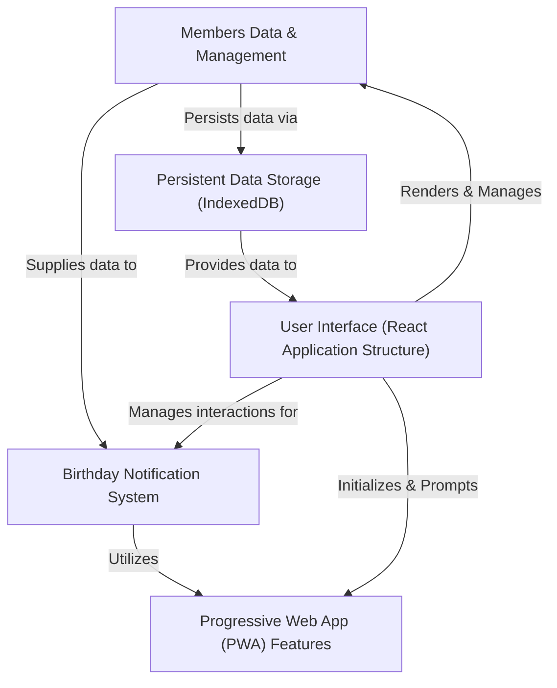

# Tutorial: Birthday_Remainder

This project is a *user-friendly* **Birthday Reminder** application designed to help you *never forget* someone's special day. It allows you to **add and manage** details for all your friends and family, stores their birthdays directly in your browser, and sends **timely notifications** to ensure you're always prepared to celebrate. You can even **install it like a native app** on your device!

## Visual Overview

## Chapters

1. [User Interface (React Application Structure)
](01_user_interface__react_application_structure__.md)
2. [Members Data & Management
](02_members_data___management_.md)
3. [Persistent Data Storage (IndexedDB)
](03_persistent_data_storage__indexeddb__.md)
4. [Birthday Notification System
](04_birthday_notification_system_.md)
5. [Progressive Web App (PWA) Features
](05_progressive_web_app__pwa__features_.md)

---

Generated by [AI Codebase Knowledge Builder](https://github.com/The-Pocket/Tutorial-Codebase-Knowledge).
